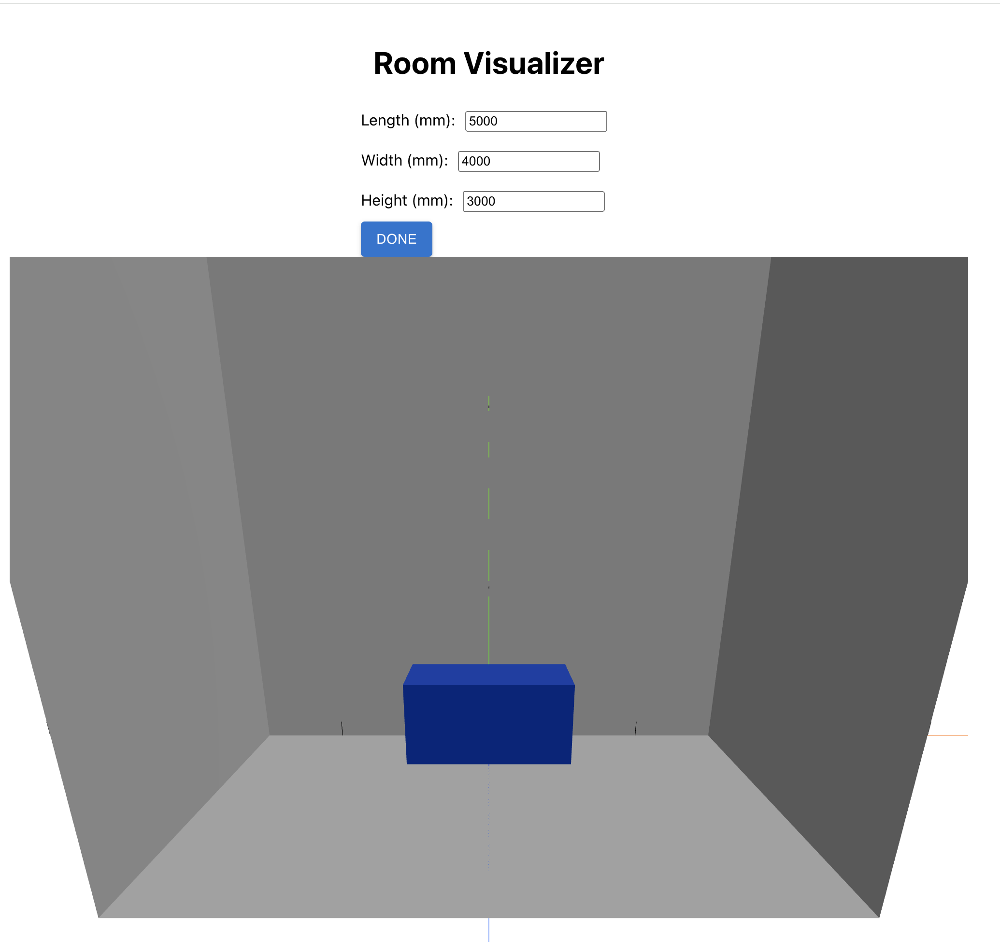

# room-visualizer

`npm start`

# Done:

- _4 Feb:_
  - Starting the basic default application
  - Form on the top + Rotating cube below
- _19 Feb:_
  - Axis for rendering
  - Camera position change to look from aside
  - Problem: the room corner is in the center of the Room -> Need to come back to RoomProvider
- _20 Feb:_
  - Added PositionAdjuster
  - prettier
  - 

# Nearest plans:

- Experiments with Raycaster. It does not change the color, `intersectObjects` return empty list.

# Comments:

1. This is fine:

```
Search for the keywords to learn more about each warning.
To ignore, add // eslint-disable-next-line to the line before.

WARNING in ./node_modules/@react-three/drei/node_modules/@mediapipe/tasks-vision/vision_bundle.mjs
Module Warning (from ./node_modules/source-map-loader/dist/cjs.js):
Failed to parse source map from '/Users/anast/Documents/codesignal/room-visualizer/node_modules/@react-three/drei/node_modules/@mediapipe/tasks-vision/vision_bundle_mjs.js.map' file: Error: ENOENT: no such file or directory, open '/Users/anast/Documents/codesignal/room-visualizer/node_modules/@react-three/drei/node_modules/@mediapipe/tasks-vision/vision_bundle_mjs.js.map'
```
