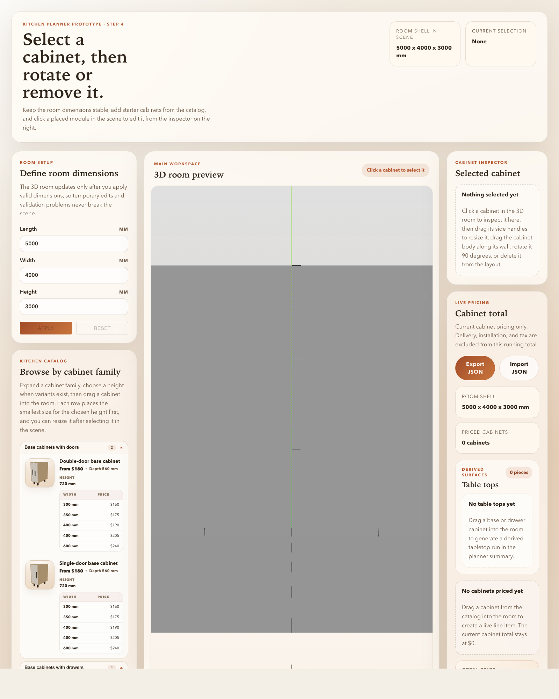
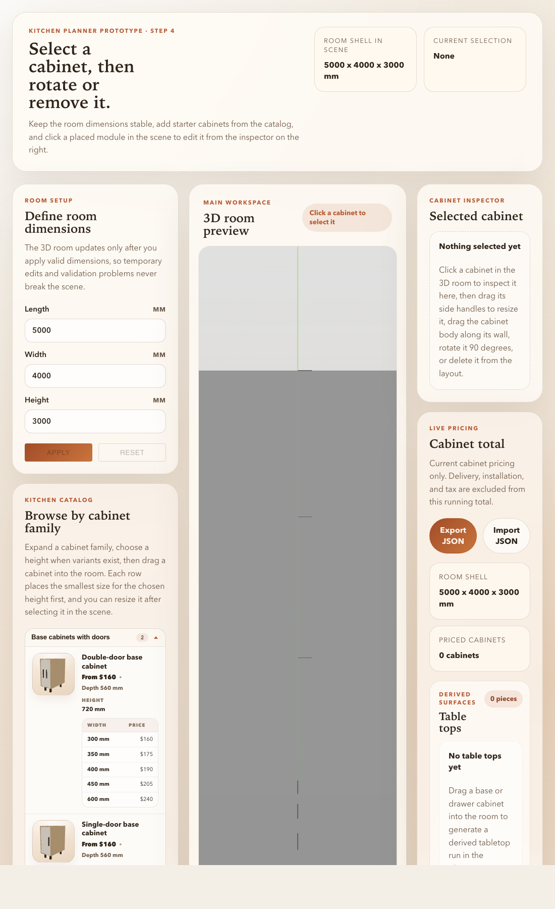

# Room Visualizer

Room Visualizer is a kitchen planning prototype built with React and React Three Fiber. It lets a user define a room, place cabinet modules in a 3D scene, and see transparent prototype pricing without needing to contact a sales manager first.

## Screenshots

### Desktop overview



### Narrow planner view



## Why this project exists

Kitchen pricing is often hidden behind manual quotes and back-and-forth with a manager. This project explores a simpler flow where a customer can build a starter kitchen layout on their own, understand the available modules, and see how layout choices affect the running total.

## What the prototype can do

- Define room dimensions in millimeters and apply only valid values to the 3D room shell.
- Browse a starter catalog of base, drawer, wall, lift-up, tall, and corner cabinets.
- Drag cabinets into the scene and place them on the back, left, or right wall.
- Select a placed cabinet and move it along its wall, resize it through supported widths, rotate it, or delete it.
- Inspect the selected cabinet's family, dimensions, footprint, wall position, and prototype price.
- Keep a live cabinet total in USD and derive tabletop runs from supported base and drawer cabinets.
- Export a project to JSON and import it later, including comparison between saved pricing snapshots and the current catalog.

## Current status

This is still a prototype and not a production quoting tool.

- Pricing currently covers cabinet modules only.
- Delivery, installation, tax, and custom materials are not included.
- The scene uses simplified cabinet blocks by default rather than final photorealistic renders.
- There is no 2D plan, account system, or browser autosave yet.

## Tech stack

- React 18
- React Three Fiber
- Drei
- Material UI
- Create React App

## Getting started

```bash
npm install
npm start
```

Then open [http://localhost:3000](http://localhost:3000).

## How to try the planner

1. Adjust the room dimensions in `mm` if needed, then click `Apply`.
2. Expand a cabinet family in the left-side catalog.
3. Drag a cabinet row into the 3D room and release it on a valid wall.
4. Click a placed cabinet to edit it from the scene and the inspector panel.
5. Review the live pricing summary on the right.
6. Export the project as JSON or import a saved project file.

## Available scripts

- `npm start` runs the local development server.
- `npm test` runs the test suite.
- `npm run build` creates a production build.
- `npm run format` formats the repository with Prettier.
- `npm run prices:update` recalculates all starter cabinet prices from the manual pricing config and refreshes `config/cabinet-pricing.generated.json` with compact per-variant pricing steps.
- `npm run prices:check` verifies whether the catalog prices and generated pricing breakdowns are already in sync with the config.
- `npm run manufacturing:update` generates per-variant panel, edge-banding, perimeter, and hole metadata in `config/cabinet-manufacturing.generated.json`.
- `npm run manufacturing:check` verifies whether the manufacturing metadata file is already in sync.

## Updating cabinet prices

1. Edit `config/cabinet-pricing.config.json`.
2. Run `npm run prices:update`.
3. Review the regenerated prices in `src/features/cupboards/model/starterCabinetCatalogDefinitions.json`.
4. Inspect the generated per-variant breakdowns in `config/cabinet-pricing.generated.json`.

For a fuller breakdown of the config structure and pricing workflow, see `docs/cabinet-pricing.md`.

## Project structure

- `src/features/planner` contains the planner page, layout panels, room form, and JSON import/export flow.
- `src/features/room` contains the 3D room shell, wall targeting, and interaction helpers.
- `src/features/cupboards` contains the cabinet catalog, placement rules, pricing selectors, and cupboard state.
- `mds/` contains product notes, architecture ideas, and planning documents.
- `RELEASE_NOTES.md` contains the historical change log.
