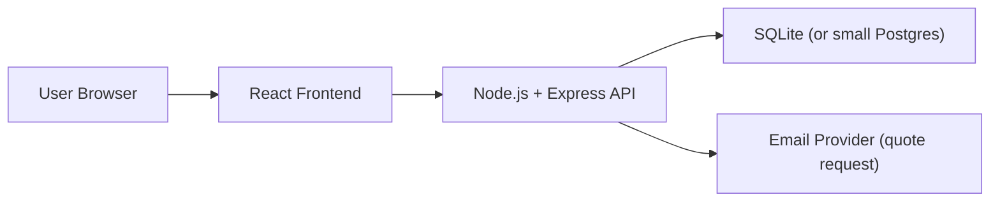

# Lightweight Architecture Plan - Kitchen Planner

## 1. Scope and Constraints

This project should stay simple:

- Around 10 users per week.
- Around 50 furniture modules in catalog.
- No horizontal scaling required.
- Fast implementation is more important than enterprise architecture.

Design decision: use one small web application (frontend + one simple backend API + one database), no microservices.

---

## 2. Target Architecture (Simple Monolith)



### Why this is enough

- Traffic is low, so one backend instance is enough.
- Catalog size is small, so data operations are light.
- No cache, queue, message broker, or separate services are needed.

---

## 3. Frontend Components and Responsibilities

## 3.1 UI Layer

### `PlannerPage`
- Responsibility:
  - Main page container.
  - Composes all planner UI blocks.
- Owns:
  - Page-level layout only.

### `HeaderBar`
- Responsibility:
  - Shows project title, save status, and primary action button ("Request quote").
  - Shows short guidance text for current mode.

### `LeftSidebar`
- Responsibility:
  - Shows project structure and list of placed modules.
  - Lets user select an item to edit.

### `CatalogPanel`
- Responsibility:
  - Shows available furniture modules (about 50).
  - Supports category filter and text search.
  - Triggers "add module" action.

### `RoomCanvas`
- Responsibility:
  - Displays room and placed modules (2D or simple 3D view).
  - Supports select, place, move, rotate interactions.
  - Shows visual feedback for invalid placement.

### `ModuleInspector`
- Responsibility:
  - Edits selected module properties (size option, material, quantity, orientation).
  - Exposes delete/duplicate actions.

### `RightToolsBar`
- Responsibility:
  - Global scene tools (zoom fit, reset view, toggle dimensions, measure mode).

### `PriceSummaryBar`
- Responsibility:
  - Shows running subtotal and final estimated total.
  - Displays transparent line-by-line cost summary.

### `QuoteRequestModal`
- Responsibility:
  - Collects customer contact details.
  - Sends current project snapshot + pricing to backend.

### `ToastNotifications`
- Responsibility:
  - Displays errors and confirmations (saved, validation issue, quote sent).

---

## 3.2 Frontend Logic Layer

### `PlannerStore` (Reducer + Context)
- Responsibility:
  - Single source of truth for planner state:
    - Room dimensions
    - Placed modules
    - Selected module
    - Active tool mode
    - Pricing snapshot
- Rule:
  - UI reads from store; all changes happen via actions.

### `CatalogService` (client-side)
- Responsibility:
  - Loads module catalog from backend once on page load.
  - Provides normalized lookup by module id.

### `PlacementEngine`
- Responsibility:
  - Applies layout rules while user places or moves modules:
    - Snap to wall/grid
    - Keep inside room bounds
    - Basic collision checks

### `PricingEngine` (client-side preview)
- Responsibility:
  - Calculates live estimate instantly from current state.
  - Uses integer money calculations.
- Note:
  - Backend recalculates again for final quote persistence.

### `ValidationService`
- Responsibility:
  - Validates user actions and quote submission:
    - Required room params
    - Valid module dimensions
    - Quantity limits
    - Contact form fields

### `DraftPersistenceService`
- Responsibility:
  - Autosaves draft to `localStorage`.
  - Restores draft on page reload.

---

## 4. Backend Components and Responsibilities

Use one small Node.js + Express app.

### `ApiServer`
- Responsibility:
  - Hosts REST endpoints.
  - Applies request validation and error handling.

### `CatalogController`
- Responsibility:
  - `GET /api/catalog`
  - Returns modules, materials, and price parameters.

### `ProjectController`
- Responsibility:
  - `POST /api/projects` create/update draft project.
  - `GET /api/projects/:id` load saved project.
  - Persists project JSON snapshots.

### `PricingController`
- Responsibility:
  - `POST /api/pricing/preview`
  - Recalculates totals server-side for consistency.

### `QuoteController`
- Responsibility:
  - `POST /api/quotes/request`
  - Stores lead + project snapshot + pricing.
  - Triggers email notification to business inbox.

### `EmailService`
- Responsibility:
  - Sends quote request email with reference id.
  - Can use simple provider (SMTP, Resend, SendGrid, etc.).

---

## 5. Data Components

## 5.1 Catalog Source

### `catalog.json`
- Responsibility:
  - Stores about 50 modules, materials, and default pricing values.
  - Maintained manually or with a tiny admin script.

Suggested module fields:
- `id`
- `name`
- `category`
- `widthOptionsMm`
- `heightMm`
- `depthMm`
- `basePriceCents`
- `materialMultiplier`

## 5.2 Database

Use `SQLite` first (simplest operationally). Move to managed Postgres only if needed later.

Tables:
- `projects`
  - `id`, `created_at`, `updated_at`, `project_json`
- `quote_requests`
  - `id`, `created_at`, `name`, `phone`, `email`, `comment`, `project_id`, `totals_json`

---

## 6. Component Interaction Flow

## 6.1 Add Module
1. User picks module in `CatalogPanel`.
2. `PlannerStore` receives `ADD_MODULE`.
3. `PlacementEngine` validates/snaps position.
4. `RoomCanvas` updates view.
5. `PricingEngine` recalculates totals.

## 6.2 Edit Module
1. User selects module in `LeftSidebar` or `RoomCanvas`.
2. `ModuleInspector` edits properties.
3. `PlannerStore` updates state.
4. `PricingEngine` recomputes totals.

## 6.3 Save Draft
1. `DraftPersistenceService` writes to `localStorage` every few seconds or on change.
2. Optional manual save calls `POST /api/projects`.

## 6.4 Request Quote
1. User clicks `Request quote`.
2. `QuoteRequestModal` validates contact fields.
3. Frontend sends project + totals to `POST /api/quotes/request`.
4. Backend saves request and sends notification email.
5. UI shows success message with request id.

---

## 7. Minimal Non-Functional Requirements

Keep requirements realistic for low traffic:

- Availability: best-effort, no multi-region setup.
- Performance:
  - Initial page load under 3 seconds on normal broadband.
  - Price recalculation under 100 ms on client.
- Reliability:
  - Daily DB backup.
  - Basic server logs.
- Security:
  - Input validation on all API endpoints.
  - Basic rate limit on quote endpoint.
  - HTTPS enabled.

---

## 8. What Not to Build Now

To keep this project lightweight, skip these for now:

- Microservices.
- Redis cache.
- Async job queue.
- Complex authentication/roles.
- Real-time collaboration.
- Advanced CAD export pipeline.
- Auto-scaling infrastructure.

---

## 9. Recommended Folder Structure (Simple)

```text
src/
  app/
    PlannerPage.jsx
  components/
    HeaderBar.jsx
    LeftSidebar.jsx
    CatalogPanel.jsx
    RoomCanvas.jsx
    ModuleInspector.jsx
    RightToolsBar.jsx
    PriceSummaryBar.jsx
    QuoteRequestModal.jsx
  state/
    plannerReducer.js
    PlannerContext.jsx
  domain/
    placementEngine.js
    pricingEngine.js
    validationService.js
  services/
    apiClient.js
    catalogService.js
    draftPersistenceService.js
```

---

## 10. Final Responsibility Map

- UI components: display and user interactions.
- Store and domain logic: enforce rules and keep state consistent.
- Backend API: persistence, final pricing check, quote request handling.
- Database: durable storage for projects and quote requests.
- Email service: business notification when user submits a quote request.

This architecture is intentionally small and should be easy to build and maintain for the expected usage.
