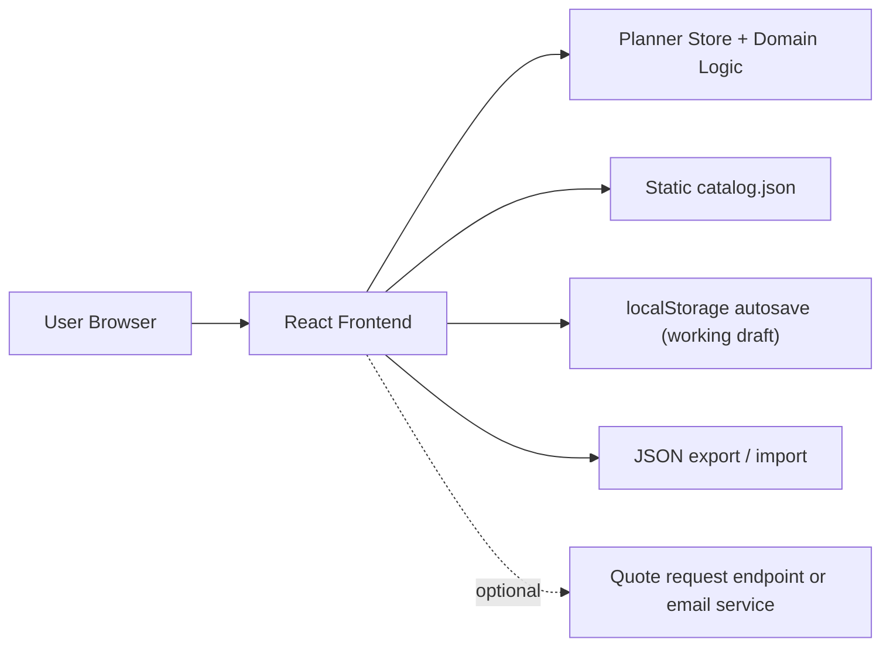

# Architecture Plan - Room Visualizer

## 1. Scope and Constraints

This project should stay simple:

- Low traffic and low concurrency (Around 50 furniture modules in catalog and around 10 active sessions for the website).
- No user accounts and no login flow.
- No server-side project storage.
- Users must be able to save and reopen projects as JSON files on their own machine.
- Fast implementation is more important than enterprise architecture.

Design decision: build one browser-first React application. Project persistence lives on the client through browser-local autosave in `localStorage` plus user-triggered JSON import/export.

Important browser constraint:

- A normal web app cannot silently read or write arbitrary files in a user's local directory.
- File access must be initiated by the user.
- This v1 should not implement the File System Access API, even in browsers that support it.
- Portable save/load in v1 uses JSON download/upload only.

---

## 2. Target Architecture



### Why this is enough

- The current product does not need accounts, collaboration, or shared cloud persistence.
- The browser can fully own room editing, placement logic, and pricing for the current scale.
- JSON files are simple to inspect, version, export, and support manually.
- Standard browser storage plus JSON import/export is enough for v1.
- Removing project persistence from the backend reduces implementation time and operational cost.

---

## 3. Frontend Components and Responsibilities

## 3.1 UI Layer

### `PlannerPage`
- Responsibility:
  - Main page container for the whole experience.
  - Composes setup, catalog, canvas, inspector, and project file actions.

### `ProjectFileBar`
- Responsibility:
  - Exposes `New`, `Import`, and `Export`.
  - Shows current project name plus draft/export status.
  - Makes it clear that v1 uses browser autosave plus JSON import/export.

### `RoomSetupPanel`
- Responsibility:
  - Edits room dimensions and basic room settings.

### `CatalogPanel`
- Responsibility:
  - Shows available modules from the local catalog.
  - Supports search and category filtering.
  - Triggers add-module actions.

### `RoomCanvas`
- Responsibility:
  - Displays the room and placed modules.
  - Supports select, place, move, and rotate interactions.
  - Shows visual feedback for collisions or invalid placement.

### `SelectionPanel`
- Responsibility:
  - Edits the selected module's properties.
  - Exposes duplicate and delete actions.

### `Toolbar`
- Responsibility:
  - Global scene actions such as zoom, reset view, and toggle helpers.

### `PriceSummary`
- Responsibility:
  - Shows the current calculated total.
  - Explains how the price is composed.

### `ImportExportDialogs`
- Responsibility:
  - Confirms risky actions such as replacing the current project with an imported file.
  - Offers restore or discard when a local draft is found on app boot.
  - Shows validation errors for unsupported or corrupted JSON files.

### `ToastNotifications`
- Responsibility:
  - Displays success, warning, and error feedback.

---

## 3.2 Frontend Logic Layer

### `PlannerStore` (Reducer + Context)
- Responsibility:
  - Single source of truth for:
    - Room dimensions
    - Placed modules
    - Selected module
    - Active tool mode
    - Pricing state
    - Dirty/saved status
    - Current project metadata
- Rule:
  - UI reads from the store and all changes happen through actions.

### `CatalogService`
- Responsibility:
  - Loads the static catalog from `public/catalog.json`.
  - Provides normalized lookup by module id.

### `PlacementEngine`
- Responsibility:
  - Applies room rules while placing or moving modules:
    - Snap to wall or grid
    - Keep inside room bounds
    - Detect simple collisions

### `PricingEngine`
- Responsibility:
  - Calculates the live price estimate on the client.
  - Uses deterministic integer money calculations.

### `ValidationService`
- Responsibility:
  - Validates room edits, module configuration, and imported project files.

### `ProjectSerializer`
- Responsibility:
  - Converts runtime planner state into a versioned JSON document.
  - Restores planner state from JSON while ignoring derived UI-only fields.

### `ProjectFileService`
- Responsibility:
  - Implements JSON import/export behavior.
  - Creates downloadable JSON exports and reads user-selected JSON files.
  - Does not keep local file handles in v1.

### `DraftCacheService`
- Responsibility:
  - Saves the latest unsaved draft to `localStorage`.
  - Restores that draft after refresh or crash recovery.
- Rule:
  - `localStorage` is the primary working-copy protection in v1.
  - Exported JSON is the portable user-controlled saved project format.

---

## 4. Project Persistence Architecture

## 4.1 Canonical Project Format

Projects are stored as versioned JSON files.

Suggested file extension:

- `.room-project.json`

Suggested top-level structure:

```json
{
  "schemaVersion": 1,
  "projectId": "uuid",
  "projectName": "My Kitchen",
  "savedAt": "2025-03-22T20:15:00Z",
  "catalogVersion": "2025-03",
  "room": {
    "lengthMm": 5000,
    "widthMm": 4000,
    "heightMm": 3000
  },
  "modules": [
    {
      "id": "instance-1",
      "catalogItemId": "base-600",
      "position": { "x": 0, "y": 0, "z": 0 },
      "rotation": 0,
      "size": { "widthMm": 600, "heightMm": 720, "depthMm": 560 },
      "material": "oak"
    }
  ],
  "pricingSnapshot": {
    "subtotalCents": 120000
  }
}
```

Rules:

- Store only serializable business data.
- Do not store Three.js objects, refs, or derived mesh state.
- Prefer catalog references plus user choices over duplicated catalog data.
- Include `schemaVersion` from the start so future migrations stay manageable.

## 4.2 Read/Write Strategy

### Primary path: Browser-local autosave
- On planner changes, store the latest draft in `localStorage`.
- On reload, offer to restore the draft if it is newer than the last imported or exported state.
- Clear the draft only after explicit user confirmation or when starting a new project.

### Portable project copy: Export/Import
- `Export` creates a downloadable JSON file.
- `Import` reads a user-selected JSON file through a file input.
- This is the only file persistence flow in v1.

### Explicit v1 boundary
- Do not implement `Open`, `Save`, or `Save As` in v1.
- Do not implement the File System Access API in v1.
- If same-file save later becomes a hard requirement, evaluate it as a future enhancement.

## 4.3 Non-Goal

The app should not try to:

- Write into arbitrary local directories without user interaction.
- Implement browser-specific same-file save behavior in v1.
- Sync projects across devices.
- Maintain a server-side library of user projects.

If same-file save or fully automatic filesystem control becomes a hard requirement later, evaluate File System Access API or a desktop wrapper separately.

---

## 5. Backend Components

There is no backend required for project persistence.

### Required backend components in v1
- None.

### Optional backend component later

#### `QuoteRequestEndpoint`
- Responsibility:
  - Accepts contact details plus an attached project JSON snapshot.
  - Sends an email or creates a lead record.

This should stay optional and separate from project save/load. Saving a project must continue to work with zero backend availability.

---

## 6. Data Components

## 6.1 Catalog Source

### `public/catalog.json`
- Responsibility:
  - Stores module definitions, size options, materials, and pricing inputs.
  - Is loaded directly by the frontend.

Suggested module fields:

- `id`
- `name`
- `category`
- `widthOptionsMm`
- `heightMm`
- `depthMm`
- `basePriceCents`
- `materialOptions`

## 6.2 Project Schema

### `src/schemas/projectSchema.js`
- Responsibility:
  - Validates imported JSON files.
  - Shields the app from corrupted or old project documents.

## 6.3 No Database

Do not add a `projects` table or any other persistence database for v1. The exported project file is the durable portable source of truth outside the browser, and the local draft is the working copy inside the browser.

---

## 7. Component Interaction Flows

## 7.1 Add Module
1. User picks a module in `CatalogPanel`.
2. `PlannerStore` receives `ADD_MODULE`.
3. `PlacementEngine` validates and snaps the placement.
4. `RoomCanvas` updates.
5. `PricingEngine` recalculates totals.
6. `DraftCacheService` marks the project as dirty and updates the local draft.

## 7.2 Export Project
1. User clicks `Export` in `ProjectFileBar`.
2. `ProjectSerializer` converts planner state to a project document.
3. `ProjectFileService` creates a downloadable JSON file.
4. Store updates export metadata and clears the "changes since export" flag.

## 7.3 Import Project
1. User clicks `Import`.
2. `ProjectFileService` reads the selected JSON file.
3. `ValidationService` and `ProjectSerializer` validate and parse the document.
4. `PlannerStore` replaces current state with the imported project.
5. `DraftCacheService` updates the local draft with the imported project.
6. `PricingEngine` recalculates to confirm consistency with the current catalog rules.

## 7.4 Recover Draft
1. App boots.
2. `DraftCacheService` checks `localStorage` for an unsaved draft.
3. If present, UI offers restore or discard.
4. If restored, the planner loads the draft as working state, not as a saved file.

## 7.5 Optional Quote Request
1. User chooses to request a quote.
2. Frontend packages contact details plus the current project JSON.
3. Optional backend or email integration handles delivery.
4. Failure here must not affect local save/load behavior.

---

## 8. Minimal Non-Functional Requirements

- Performance:
  - Initial page load under 3 seconds on normal broadband.
  - Local export and import operations should feel immediate for normal project sizes.
- Reliability:
  - Imported JSON must be validated before state mutation.
  - Draft recovery should survive refresh and accidental tab close.
  - After initial load, short network interruptions must not affect current in-browser editing or local autosave.
- Compatibility:
  - The app relies only on standard browser storage and file upload/download APIs used across major browsers.
  - File System Access API is not required and should not be implemented in v1.
  - Reloading the app while fully offline is not guaranteed in v1 unless the app shell is already cached by the browser.
- Security:
  - Never execute imported content.
  - Treat imported JSON as untrusted input.
- Privacy:
  - Project data remains on the user's machine unless they explicitly export or submit it.

---

## 9. Recommended Folder Structure

```text
public/
  catalog.json

src/
  app/
    PlannerPage.jsx
  components/
    ProjectFileBar.jsx
    RoomSetupPanel.jsx
    CatalogPanel.jsx
    RoomCanvas.jsx
    SelectionPanel.jsx
    Toolbar.jsx
    PriceSummary.jsx
    ImportExportDialogs.jsx
  state/
    plannerReducer.js
    PlannerContext.jsx
  domain/
    placementEngine.js
    pricingEngine.js
    validationService.js
  services/
    catalogService.js
    draftCacheService.js
    projectFileService.js
    projectSerializer.js
  schemas/
    projectSchema.js
```

This folder structure is a target shape. Existing files such as `RoomVisualizer.jsx` and `CupBoardProvider.jsx` can be refactored into this structure incrementally.

---

## 10. Final Responsibility Map

- UI components:
  - Display planner state and collect user actions.
- Store and domain logic:
  - Keep room editing, placement, and pricing consistent.
- Project persistence services:
  - Autosave the working draft and import/export local project documents.
- Catalog data:
  - Define the available modules and pricing inputs.
- Optional quote integration:
  - Send a project snapshot outward without becoming the primary persistence layer.

This architecture keeps the product aligned with the actual requirement: no accounts, no server-side project library, browser-local loss protection while editing, and portable project persistence through JSON import/export.
