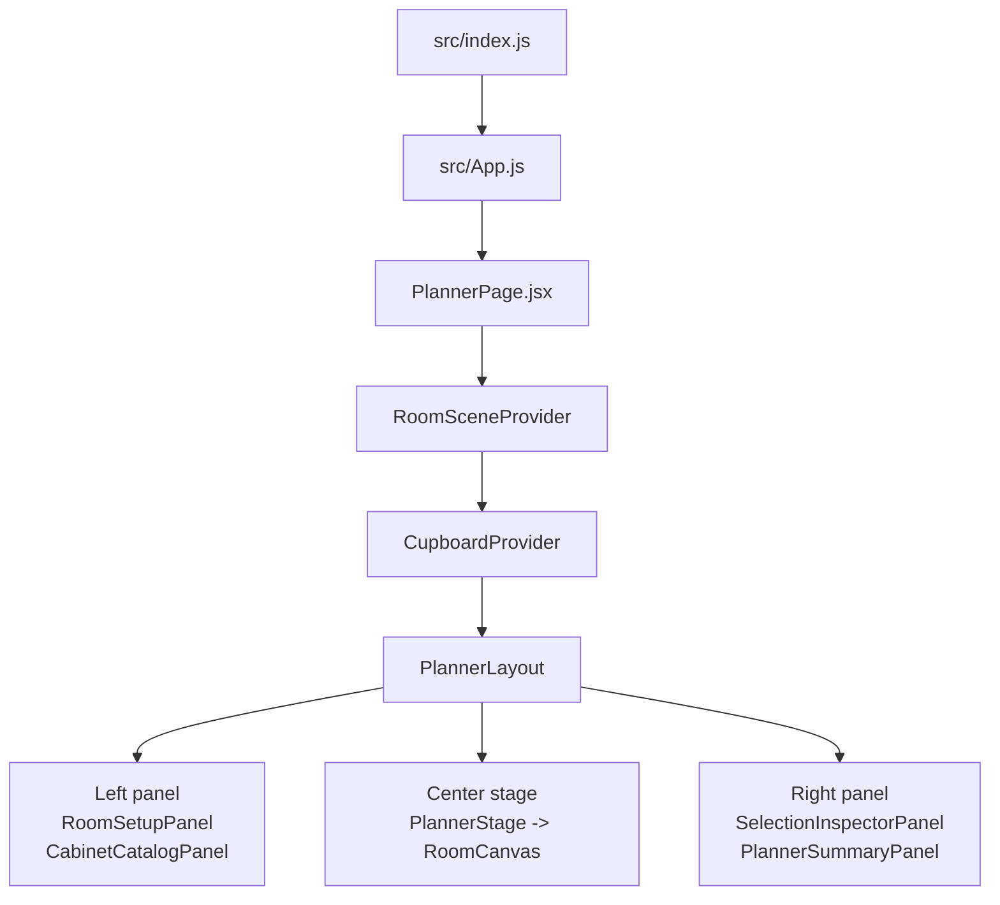
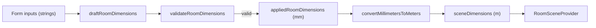
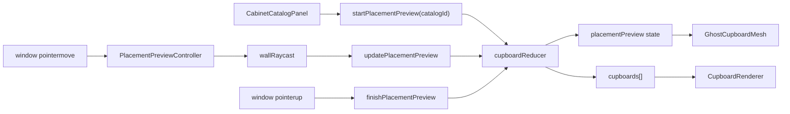
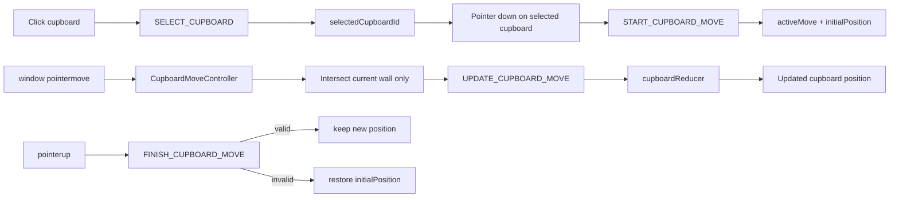

# Learning Explanation of `room-visualizer`

## 1. What this project actually is

This is a single-screen React application that combines:

- a classic React control surface for forms and panels,
- a 3D scene rendered with `@react-three/fiber`,
- a reducer-driven domain state for cabinet placement and movement,
- a thin math layer for room bounds, wall snapping, and raycasting.

It is not a "large React app" in the routing / API / data-fetching sense. It is closer to an interactive CAD-like prototype with a declarative UI wrapped around an imperative pointer-driven 3D interaction loop.

The fastest correct mental model is:

> React owns the application state and the UI shell.  
> Three.js owns the scene graph and raycasting.  
> The reducer is the contract between the two.

---

## 2. Read the project in this order

If you want to learn how to build a project like this, read the code in this order:

1. Boot and composition
   - `src/index.js:7`
   - `src/App.js:4`
   - `src/features/planner/PlannerPage.jsx:44`
2. Room form state
   - `src/features/planner/hooks/useRoomDimensionsForm.js:12`
   - `src/features/planner/lib/roomValidation.js:1`
   - `src/lib/units.js:1`
3. Scene coordinate model
   - `src/features/room/context/RoomSceneContext.jsx:5`
   - `src/features/room/components/RoomShell.jsx:9`
4. Cabinet domain state machine
   - `src/features/cupboards/state/CupboardProvider.jsx:9`
   - `src/features/cupboards/state/cupboardReducer.js:59`
   - `src/features/cupboards/model/placement.js:28`
5. Pointer-to-scene translation
   - `src/features/room/lib/wallRaycast.js:5`
   - `src/features/room/components/PlacementPreviewController.jsx:9`
   - `src/features/room/components/CupboardMoveController.jsx:9`
6. Rendering layer
   - `src/features/cupboards/components/CupboardRenderer.jsx:6`
   - `src/features/cupboards/components/CupboardMesh.jsx:53`
   - `src/features/room/components/RoomCanvas.jsx:12`
7. Tests that describe intent
   - `src/features/cupboards/state/cupboardReducer.test.js`
   - `src/features/cupboards/model/placement.test.js`
   - `src/features/planner/lib/roomValidation.test.js`

That order mirrors the runtime dependency graph.

---

## 3. Directory structure and responsibility split

```text
src/
  index.js                         # CRA entrypoint
  App.js                           # mounts the planner page
  config/
    plannerConfig.js               # render-mode toggle
  lib/
    units.js                       # mm <-> m conversion
  features/
    planner/
      PlannerPage.jsx              # top-level composition
      components/                  # panels and shell UI
      hooks/                       # room form state
      lib/                         # validation + formatting
      styles/                      # planner-specific CSS
    room/
      context/                     # room dimensions, bounds, position
      components/                  # Canvas, room shell, controllers
      lib/                         # raycasting / wall intersection math
    cupboards/
      state/                       # reducer + provider
      model/                       # catalog, placement, geometry, render model
      components/                  # cabinet meshes / renderers
```

This is a feature-oriented structure, but the slices are not equal:

- `planner` is the orchestration and presentation layer.
- `room` is spatial infrastructure.
- `cupboards` is the real domain model.

That is a useful pattern. The business rules do not live in panels or canvas components.

---

## 4. Top-level architecture



Important point: `PlannerPage` is where the dependency direction is established.

- `RoomSceneProvider` depends on room dimensions.
- `CupboardProvider` depends on `RoomSceneProvider`, because cabinet actions need current room bounds.
- UI panels and 3D scene both consume the same cupboard state.

This means the scene is not a separate app. It is just another view over the same reducer state.

---

## 5. The three core state domains

| State domain | Owner | Shape | Purpose |
| --- | --- | --- | --- |
| Room form state | `useRoomDimensionsForm` | draft strings, applied numeric dimensions, validation errors | lets the user edit dimensions without immediately destabilizing the scene |
| Scene geometry state | `RoomSceneProvider` | `dimensions`, `bounds`, `roomPosition` | converts room size into a spatial coordinate system |
| Cabinet interaction state | `cupboardReducer` | `cupboards`, `placementPreview`, `activeMove`, `selectedCupboardId` | models placement, selection, movement, deletion |

This split is the main architectural idea of the project.

### Why this split is good

The room form is not mixed with cabinet placement logic.  
The room geometry is not recomputed ad hoc in every component.  
The cabinet interaction state is centralized and explicit.

That is the difference between "React components that happen to work" and "an application with a stable behavioral model".

---

## 6. Step-by-step runtime flow

## Step 1: boot the app

`src/index.js` renders `<App />` into `#root`, and `App` renders only `<PlannerPage />`.

That tells you immediately:

- there is no router,
- there are no multiple screens,
- the whole app is this planner.

This is a prototype architecture, not a product-shell architecture.

---

## Step 2: create room form state, then derive scene dimensions

`useRoomDimensionsForm` is the first important piece of real application logic.

It maintains two separate representations:

- `draftRoomDimensions`: strings from the inputs
- `appliedRoomDimensions`: validated numeric values

This is the right move for UI engineering. Input state and domain state are not the same thing.

The key design choice is here:

- input edits change only the draft state,
- the 3D scene updates only after `handleApplyRoom`,
- invalid drafts never become scene state.

So the hook acts like a small transactional boundary.



### Why this matters

If you update the scene on every keystroke, you get partial invalid states like `""`, `"0"`, or `"-"`.  
This hook prevents that class of bug entirely.

---

## Step 3: convert dimensions into a room coordinate system

`RoomSceneProvider` is deceptively important.

It converts a raw room size into:

- `bounds`
- `roomPosition`

### `bounds`

`createRoomBounds()` builds a symmetric local coordinate system:

- `left/right`
- `back/front`
- `floor/ceiling`

These bounds are centered around the room's local origin.

### `roomPosition`

`createRoomPosition()` shifts the rendered room in world space:

- `y = height / 2`
- `z = width / 2`

That is a subtle but smart trick.

It means:

- the room floor ends up at world `y = 0`,
- the back wall ends up at world `z = 0`,
- internal calculations can still use symmetric local bounds.

So the app uses **local room coordinates for math** and **world coordinates for rendering**, then converts between them when raycasting.

This is exactly the kind of abstraction that makes spatial code maintainable.

---

## Step 4: compose providers at the planner page

`PlannerPage.jsx` is the real application root.

It does three things:

1. creates room state via `useRoomDimensionsForm()`,
2. exposes room geometry via `RoomSceneProvider`,
3. exposes cabinet state/actions via `CupboardProvider`.

This is the dependency chain:

- room dimensions -> room bounds
- room bounds -> cabinet actions
- cabinet state -> panels + scene

`PlannerLayout` itself is intentionally thin. It mostly wires data into panels.

That is good architecture. The page composes; it does not do math.

---

## Step 5: treat cabinet behavior as a reducer-backed state machine

The most important file in the project is `src/features/cupboards/state/cupboardReducer.js`.

The reducer state is:

```js
{
  cupboards: [],
  placementPreview: null,
  activeMove: null,
  selectedCupboardId: null,
  nextCupboardId: 1
}
```

This is effectively a small interaction state machine.

### The state machine modes

- Idle: nothing selected, no preview, no move
- Previewing placement: `placementPreview !== null`
- Selected: `selectedCupboardId !== null`
- Moving: `activeMove !== null`

### Why reducer architecture works well here

The UI and the 3D scene can fire many different events:

- pointer down on catalog item
- pointer move over canvas
- pointer up anywhere
- click cabinet
- drag selected cabinet
- press Escape
- rotate
- delete

A reducer gives you one explicit transition system for all of them.

That is much better than scattering `useState` across five components.

---

## Step 6: understand the provider as an adapter, not just storage

`CupboardProvider.jsx` does more than expose reducer state.

It injects `roomBounds` from `useRoomScene()` into every action payload:

- `START_PLACEMENT_PREVIEW`
- `UPDATE_PLACEMENT_PREVIEW`
- `UPDATE_CUPBOARD_MOVE`
- `ROTATE_SELECTED_CUPBOARD`

This is a strong design choice.

The reducer stays pure because:

- it does not read React context,
- it does not query the scene,
- it receives everything it needs in the action payload.

In other words, the provider is a dependency injection boundary.

That is a clean way to compose cross-feature data in React.

---

## Step 7: placement is "preview first, commit later"

Placement starts in `CabinetCatalogPanel`.

When the user presses on a cabinet card or clicks `Add`, the panel:

1. starts a placement session,
2. registers global `pointerup`, `pointercancel`, and `keydown` listeners,
3. dispatches `startPlacementPreview(catalogId)`.

This creates a ghost cabinet but does not place a real cabinet yet.

### Why the panel uses window listeners

Because the interaction is not scoped to the panel anymore.  
Once the user begins placement, the pointer may move anywhere in the window and release anywhere.

That is one of the core lessons of advanced React UI work:

> the declarative tree is not always the correct boundary for an interaction session.

Sometimes you need an imperative session object, and here that object is the cleanup function stored in `placementCleanupRef`.

### Placement flow



### The actual placement math

`validatePlacementCandidate()` currently does two things:

1. reject unsupported walls / missing intersections,
2. snap the candidate to the selected wall with the correct rotation.

The interesting part is that the validation object already has room for more rules:

- `OVERLAP`
- `ADJACENCY_GAP`
- `CORNER_COLLISION`

Those reasons exist, but the current validator does not implement them yet.

That tells you the architecture is forward-looking: the state model is already prepared for more advanced placement constraints.

---

## Step 8: raycasting is the bridge between pointer events and domain state

`PlacementPreviewController` and `CupboardMoveController` are the imperative edge of the app.

They are important because React itself does not know where in 3D space your mouse is pointing.

### `PlacementPreviewController`

When placement mode is active:

- it subscribes to `window.pointermove`,
- computes normalized canvas coordinates,
- updates a Three.js `Raycaster`,
- intersects the ray against virtual wall planes,
- converts the world hit back into local room coordinates,
- dispatches the hit into reducer state.

### `wallRaycast.js`

This file is pure infrastructure:

- define wall planes,
- clamp hits to valid wall bounds,
- convert world points back to room-local coordinates,
- choose the closest valid wall.

This is exactly the sort of code that should not be buried inside JSX.

### Advanced point

The app does **not** raycast against actual rendered meshes.  
It raycasts against mathematical planes created from room bounds.

That is a strong choice because:

- it is cheaper,
- it is deterministic,
- it decouples interaction math from visual mesh details.

For CAD-like tooling, that is usually the right abstraction.

---

## Step 9: movement is intentionally constrained

Dragging an already placed cabinet is a separate interaction mode.

The user flow is:

1. click cabinet to select,
2. pointer-down on the selected cabinet to start move,
3. move only along the cabinet's current wall,
4. release to commit,
5. invalid release reverts to original position.

This behavior is encoded in multiple layers:

- `CupboardRenderer` gives `onMoveStart` only to the selected cupboard
- `CupboardMesh` fires `onPointerDown` only when movement is allowed
- `CupboardMoveController` raycasts only against the original wall
- `cupboardReducer` stores `initialPosition` and restores it on invalid finish

That is a very deliberate UX model. It avoids accidental drag on first click and avoids wall-hopping during movement.

### Move flow



This is a good example of interaction design encoded as state transitions rather than ad hoc event handlers.

---

## Step 10: rendering is mostly a projection of state

Once you understand the reducer, the rendering layer becomes straightforward.

### `RoomCanvas`

This is the 3D host:

- creates the `Canvas`,
- configures camera and lighting,
- disables `OrbitControls` during placement/move,
- clears selection on pointer miss when no interaction mode is active.

That last part is easy to miss, but it is an important interaction rule.

### `RoomShell`

This builds the scene graph:

- translucent `RoomBox`
- left, right, and back wall planes
- floor plane
- `CupboardRenderer`

Notice that the room shell is static geometry plus a dynamic child renderer.

### `CupboardRenderer`

This just maps reducer state to meshes:

- `cupboards[]` -> `CupboardMesh`
- `placementPreview` -> `GhostCupboardMesh`

That is a healthy pattern: renderers should be boring.

### `CupboardMesh`

This is the interaction-aware mesh wrapper:

- transforms domain positions into Three group transforms,
- selects between simple and fancy cabinet bodies,
- attaches pointer handlers,
- renders outline feedback for selected/moving/ghost states.

The important insight is that mesh components should not own business rules.  
They should emit interaction events and reflect state visually.

---

## Step 11: the catalog and render-model layers are separate for a reason

The cabinet stack has two distinct concepts:

### Catalog data

`catalog.js` defines the product-like entities:

- id
- name
- category
- width / height / depth
- price

### Render model

`renderModel.js` defines how a cabinet should look:

- shell thickness
- front style
- handle defaults
- leg defaults
- shelf counts

This separation matters because in a real planner:

- catalog data may come from product or pricing systems,
- render defaults may come from design-system or visualization rules,
- the same business entity may have multiple visual representations.

That is a very good modeling instinct.

Also note the render-mode switch in `src/config/plannerConfig.js:1`.

The project can render:

- `BOX` mode: simple box geometry
- `FANCY` mode: constructed cabinet parts

That is a useful development trick. Start with boxes for interaction correctness, then layer on visual complexity later.

---

## Step 12: the right-side panels are read models

`SelectionInspectorPanel` and `PlannerSummaryPanel` do not own domain behavior.  
They are read models over the reducer state.

Examples:

- the inspector derives footprint dimensions from geometry helpers,
- it formats positions and prices for humans,
- it offers reducer-backed actions like rotate, delete, and clear selection.

This is another useful lesson:

> panels should usually be projections of domain state, not hidden state machines.

That keeps the behavioral center of gravity in one place.

---

## 7. What is especially worth learning from this project

## Pattern A: imperative edges, declarative core

The app is not purely declarative, and that is correct.

Declarative:

- React tree
- provider state
- renderer output

Imperative:

- global pointer listeners
- Three raycaster
- coordinate conversion

The reducer sits between them.  
That is the right architecture for interactive graphics tooling.

## Pattern B: push complexity into pure functions

The best files in this project are the pure ones:

- `roomValidation.js`
- `placement.js`
- `geometry.js`
- `renderModel.js`
- `wallRaycast.js`

That is why the tests are meaningful.  
Most interesting behavior can be tested without rendering React components.

## Pattern C: isolate unit conversion

The user thinks in millimeters.  
Three.js scene math wants meters.

The app converts at defined boundaries instead of mixing units everywhere.  
That is basic engineering hygiene, but it becomes critical in geometry-heavy apps.

---

## 8. Subtle design details that matter

### 1. Selection and dragging are intentionally separated

First click selects.  
Second pointer-down on the selected object starts movement.

That is an interaction design decision, not an accident.

### 2. Camera controls are disabled during manipulation

`OrbitControls` are turned off while placing or moving.  
That prevents camera motion from competing with object manipulation.

### 3. Effects clean up correctly under React Strict Mode

This app uses `React.StrictMode` in `src/index.js:8`.  
That means effects may mount/unmount twice in development.

The global listener cleanup in:

- `CabinetCatalogPanel`
- `PlacementPreviewController`
- `CupboardMoveController`

is therefore not optional. It is required correctness.

### 4. Existing cabinets are not revalidated on room resize

This is a current architectural gap.

When room dimensions change:

- room bounds update,
- scene geometry updates,
- cabinet positions remain as they were.

There is no reconciliation pass to clamp, move, or invalidate already placed cabinets.

That is the kind of issue you would address next if turning the prototype into a robust planner.

### 5. Validation is structurally richer than its current implementation

The reducer and UI already understand invalid reasons.  
The domain math currently implements only "supported wall" and snapping.

That means the state model is ahead of the algorithm.  
This is often a good intermediate refactoring state.

---

## 9. How I would teach someone to build this from scratch

If you wanted to build this project yourself, I would do it in this sequence:

1. Define the canonical domain entities.
   - `RoomBounds`
   - `CabinetCatalogItem`
   - `PlacedCabinet`
   - `PlacementPreview`
   - `ActiveMove`
2. Decide unit boundaries early.
   - UI in mm
   - scene math in m
3. Write pure geometry helpers before React.
   - bounds
   - wall alignment
   - footprint under rotation
   - snapping
4. Write a reducer as the interaction state machine.
   - start preview
   - update preview
   - finish / cancel preview
   - select
   - start / update / finish move
   - rotate / delete
5. Test the reducer and math layer.
   - do this before polishing meshes
6. Add a room scene provider.
   - expose `bounds`, `dimensions`, `roomPosition`
7. Add a minimal renderer.
   - boxes first
   - realistic cabinet geometry later
8. Add controller components that bridge pointer events to reducer actions.
   - raycasting belongs here, not in the reducer
9. Add inspector / summary panels as projections of reducer state.
10. Only after that, add advanced placement validation.
   - collision detection
   - adjacency rules
   - wall compatibility
   - persistence

That is essentially the sequence this codebase suggests, and it is the right one.

---

## 10. What the tests reveal about the architecture

The tests tell you where the author believes the real logic lives.

That logic is not in visual components.  
It is in:

- placement math,
- geometry normalization,
- render-model merging,
- reducer transitions,
- room validation.

That is a strong sign of a healthy architecture.

If the only testable behavior lived inside mounted components, the app would be much harder to evolve.

---

## 11. Final mental model

The cleanest way to think about this project is:

```text
UI panels produce intents.
Controllers translate pointer motion into spatial facts.
The reducer turns intents + spatial facts into state transitions.
Renderers project state into HTML and 3D meshes.
```

Or more formally:

```text
intent -> state machine -> scene projection
```

That is the key lesson to carry into your own React + 3D applications.

If you keep the domain logic pure and central, React becomes a composition tool instead of a place where state leaks everywhere.
